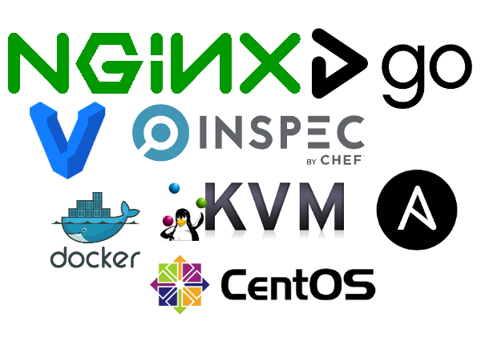
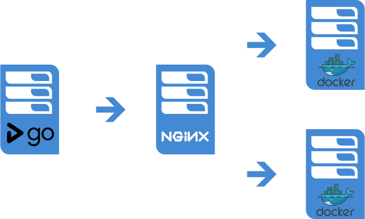
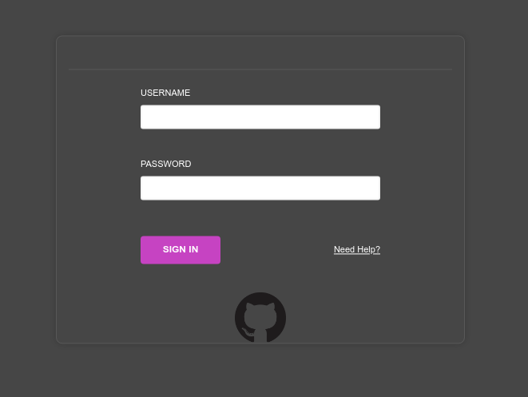
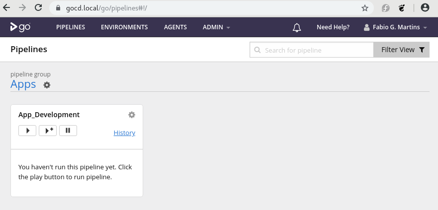
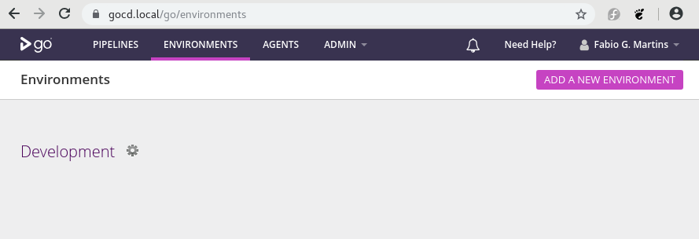
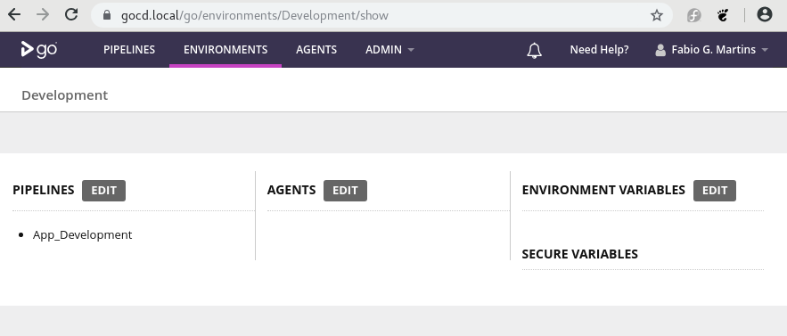
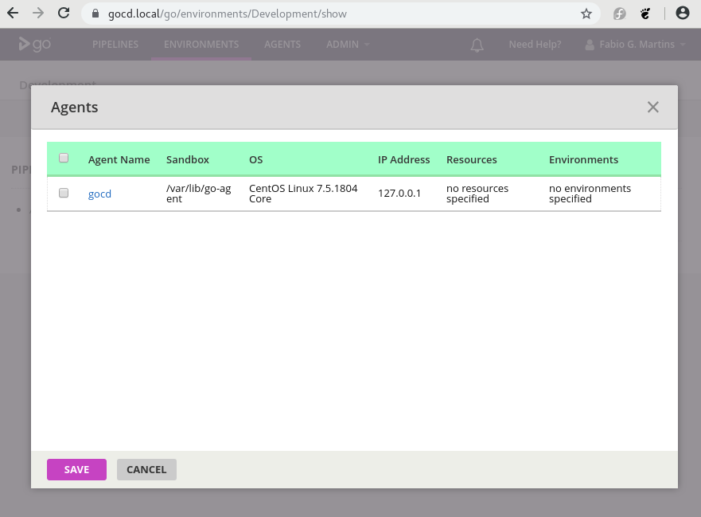
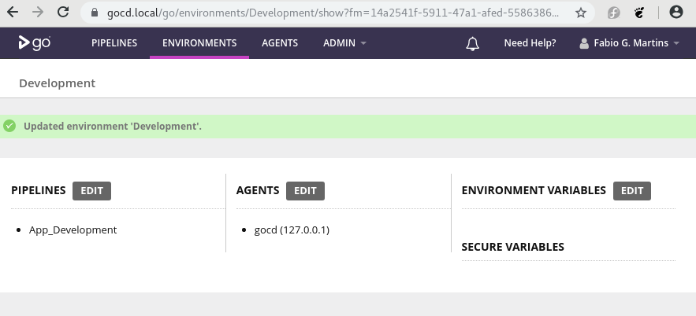

# GoCD

This project aims to show a quick demo of an application deployment with zero downtime, by leveraging the usage of [GoCD](https://www.gocd.org/) pipelines, combined with [Ansible](https://www.ansible.com/) playbooks.

## Tools used on this demo

I'm assuming you run GNU/Linux on your desktop (I'm currently running this demo on Fedora 28), have installed and configured [nss-mdns](https://github.com/lathiat/nss-mdns), also have installed [vagrant](https://www.vagrantup.com/), [ansible](https://www.ansible.com/) and [libvirt](https://libvirt.org/). Other tools will be downloaded, installed and configured automatically by ansible playbooks.

<p align="center">
  
</p>

## Topology

The below topology, humbly describes the basic concept behind this demo.

<p align="center">
  
</p>

## Usage

This demo is a combination of two projects, [gocd-vagrant](https://github.com/fabiogoma/gocd-vagrant) and [gocd-pipelines](https://github.com/fabiogoma/gocd-pipelines).

> NOTICE: For the gocd-pipelines, no changes are required. The project will be checked out during the pipeline execution.

After checking out this project, you need to customize a few itens to match your own environment.

### Self-signed certificates generation

Navigate to the playbooks folder and run the certificate.yml playbook

```bash
$ cd gocd-vagrant/provisioning/playbooks/
$ ansible-playbook certificate.yml

PLAY [Generate NGINX self-signed certificate] *******************************************

TASK [include_role : fabiogoma.certificate] *********************************************

TASK [fabiogoma.certificate : Generate private key] *************************************
ok: [localhost -> localhost] => (item=nginx.local)

TASK [fabiogoma.certificate : Generate certificate request] *****************************

ok: [localhost -> localhost] => (item=nginx.local)

TASK [fabiogoma.certificate : Generate a Self Signed OpenSSL certificate] ***************
ok: [localhost -> localhost] => (item=nginx.local)

TASK [fabiogoma.certificate : Generate private key] *************************************
ok: [localhost -> localhost] => (item=gocd.local)

TASK [fabiogoma.certificate : Generate certificate request] *****************************
ok: [localhost -> localhost] => (item=gocd.local)

TASK [fabiogoma.certificate : Generate a Self Signed OpenSSL certificate] ***************
ok: [localhost -> localhost] => (item=gocd.local)

PLAY RECAP ******************************************************************************
localhost                  : ok=6    changed=0    unreachable=0    failed=0  
```

After the self signed certificates generation, it's not mandatory, but recommended to trust on those certificates, otherwise your browser will prompt and error during the https accesses.

> NOTICE: This demo was built using a Fedora, so the current steps can be reproduced on any RHEL/CentOS or Fedora hosts. For other operating systems, the steps might be different, but I didn't test.

Switch to the default operating system certificates folder and create a link to the newly generated certificates. Then update your certificate authority (CA) trusted database.

```bash
$ cd /etc/pki/ca-trust/source/anchors
$ ln -s <FULL PATH FOR THIS PROJECT>/provisioning/playbooks/roles/fabiogoma.certificate/files/gocd.local.crt .
$ ln -s <FULL PATH FOR THIS PROJECT>/provisioning/playbooks/roles/fabiogoma.certificate/files/nginx.local.crt .
$
```

### GoCD authentication integrated with GitHub account

In order to access GoCD web console, this demo will setup your GoCD installation to support GitHub OAuth authentication. You need to follow the GitHub recomendation to generate all needed tokens (ClientID, ClientSecret and PersonalAccessToken), you will find the official GitHub documentation [here](https://github.com/gocd-contrib/github-oauth-authorization-plugin/blob/master/INSTALL.md)

Remember to NEVER share or store those tokens unencrypted, here I'll give an overview about file encryption using ansible-vault.

Create a plain-text file at provisioning/playbooks/.vault, the content inside should be a secret, which will be used to encrypt and decrypt the GitHub tokens, altough it's already on .gitignore file, remember to never push this file to any repo, otherwise there is no point on encrypting your files ;0)

Create a YAML file with GitHub tokens at: provisioning/playbooks/roles/fabiogoma.gocd/vars/main.yml

```yaml
---
ClientId: xxxxxxxxxxxxxxxxxxxxxxx
ClientSecret: xxxxxxxxxxxxxxxxxxx
PersonalAccessToken: xxxxxxxxxxxx
```

Now, with ansible vault, encrypt the variables file

```bash
$ cd provisioning/playbooks/roles/fabiogoma.gocd/vars
$ ansible-vault --vault-password-file=../../../.vault encrypt main.yml
$
```

### SSH Keys for guest machines inside GoCD host

The setup will look for SSH Keys auto-generated by vagrant and copy them into the GoCD host, ensure there is a symbolic link at provisioning/playbooks/roles/fabiogoma.gocd/files/ called machines it should point to ../../../../../.vagrant/machines/

### Attach your newly created GoCD agent to your environment (development)

Let's now follow the manual steps to hook your gocd-agent to gocd development environment

**1. From your browser, go to https://gocd.local, you will be prompted by a login screen. Just ignore the text fields and click on octocat (GitHub) logo.**
<p align="center">
  
</p>

**2. The default dashboard will show all of your pipelines, in our case, only one. Click on ENVIRONMENTS menu at the top.**
<p align="center">
  
</p>

**3. Our Development environment will be updated and for that, click on the gear in front of the environment name.**
<p align="center">
  
</p>

**4. Now let's change the Agents column by clicking on edit button**
<p align="center">
  
</p>

**5. Select the check box on the left, close to the gocd (Agent Name), then click save.**
<p align="center">
  
</p>

**6. The new environments page should now show the gocd agent.**
<p align="center">
  
</p>
